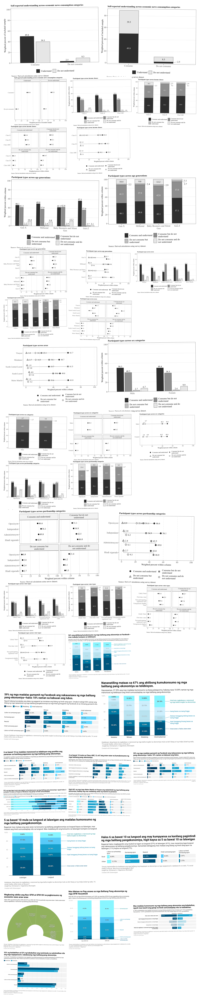

# A few visual explorations

I worked on some visuals for our paper and explored a few ways to present the results. Thought I’d share them here!

Exposure to economic news and self-reported understanding vary across groups. Here’s a look at those patterns.

Some of these are in black and white because they were prepared to follow a journal’s guidelines.

*Something I found neat: a Markdown README can show a collage and link it to an interactive gallery. Open the gallery to click and enlarge individual charts.*

<!-- The gallery URL below will work after GitHub Pages is enabled for this repository.
Until then, extract the package and open index.html locally to preview the gallery. -->

[Take a closer look →](https://ejrgigantone.github.io/Economics-Literacy-Survey-Insights/)
